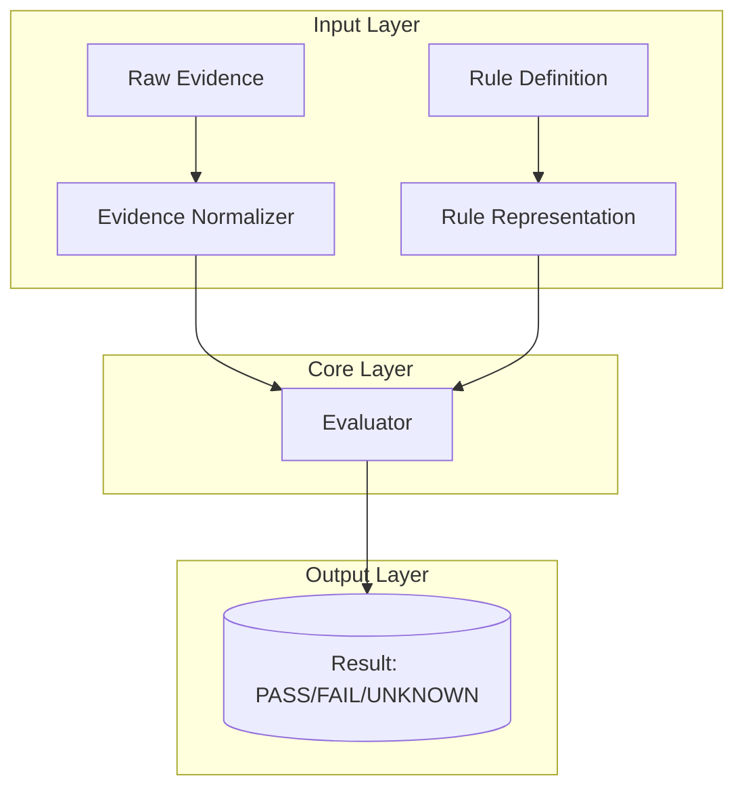

# Design Document: Deterministic Rule Engine

## Overview

This specification describes the first vertical slice of SecureCode: a deterministic rule engine for evaluating security controls. The system processes evidence (e.g., GitHub branch protection settings) and determines whether controls PASS, FAIL, or remain UNKNOWN based on deterministic rules—not LLM-based decisions.

**Key Design Decisions:**
- Pure functions only: no side effects, no external dependencies
- Immutable data structures: evidence and rules are never modified
- Explicit error handling: invalid inputs fail fast with clear messages
- Round-trip serialization: all domain objects are serializable for testing

## Architecture



### Data Flow

1. **Evidence Collection**: Raw evidence is collected from sources (e.g., GitHub API)
2. **Evidence Normalization**: Evidence is normalized to a standard format
3. **Rule Application**: Normalized evidence is evaluated against the rule
4. **Result Production**: Evaluator returns PASS, FAIL, or UNKNOWN

## Components and Interfaces

### Evidence Representation

```typescript
interface RawEvidence {
  source_id: string;
  evidence_type: string;
  raw_data: unknown;
  collected_at: string; // ISO 8601 timestamp
}

interface NormalizedEvidence {
  source_id: string;
  evidence_type: string;
  normalized_data: Record<string, unknown>;
  original_data: RawEvidence;
}
```

**Responsibilities:**
- Preserve original evidence data unmodified
- Maintain provenance tracking for derived evidence
- Support serialization for testing

### Rule Representation

```typescript
interface Rule {
  rule_id: string;
  rule_name: string;
  criteria: RuleCriteria;
}

interface RuleCriteria {
  conditions: Condition[];
  combination: "ALL" | "ANY";
}

interface Condition {
  field: string;
  operator: "gte" | "eq" | "lte" | "in" | "contains";
  value: unknown;
}
```

**GH-001 Rule Instance:**
```json
{
  "rule_id": "GH-001",
  "rule_name": "Branch Protection Required",
  "criteria": {
    "combination": "ALL",
    "conditions": [
      {
        "field": "required_review_approvals",
        "operator": "gte",
        "value": 2
      },
      {
        "field": "dismiss_stale_reviews",
        "operator": "eq",
        "value": true
      }
    ]
  }
}
```

### Evaluator Interface

```typescript
type EvaluationResult = "PASS" | "FAIL" | "UNKNOWN";

interface Evaluation {
  rule_id: string;
  result: EvaluationResult;
  evidence_id?: string;
  reason?: string;
}
```

**Evaluator Behavior:**
- Returns PASS when evidence fully satisfies rule criteria
- Returns FAIL when evidence demonstrates non-compliance
- Returns UNKNOWN when evidence is insufficient or unavailable
- Never uses probabilistic or LLM-based logic

## Data Models

### Evidence Models

```typescript
// GitHub Branch Protection Evidence
interface GitHubBranchProtectionEvidence {
  source_id: string;
  evidence_type: "github_branch_protection";
  repository: string;
  branch: string;
  required_review_approvals: number | null;
  dismiss_stale_reviews: boolean | null;
  required_linear_history: boolean | null;
  required_signatures: boolean | null;
}
```

### Rule Models

```typescript
// GH-001 Specific Rule
interface BranchProtectionRule extends Rule {
  criteria: {
    combination: "ALL";
    conditions: [
      {
        field: "required_review_approvals";
        operator: "gte";
        value: 2;
      },
      {
        field: "dismiss_stale_reviews";
        operator: "eq";
        value: true;
      }
    ];
  };
}
```

## Correctness Properties

*A property is a characteristic or behavior that should hold true across all valid executions of a system-essentially, a formal statement about what the system should do. Properties serve as the bridge between human-readable specifications and machine-verifiable correctness guarantees.*

### Property 1: Evidence Preservation

*For any* valid RawEvidence object, normalizing the evidence and then comparing to the original shall preserve all original data fields.

**Validates: Requirements 1.5**

### Property 2: Evaluation Determinism

*For any* valid evidence and rule combination, running the same evaluation multiple times shall always produce identical results.

**Validates: Requirements 3.5, 6.5**

### Property 3: Pass Semantics

*For any* evidence that fully satisfies all rule conditions, the evaluator shall return PASS.

**Validates: Requirements 4.1**

### Property 4: Fail Semantics

*For any* evidence that demonstrates non-compliance with rule conditions, the evaluator shall return FAIL.

**Validates: Requirements 4.2**

### Property 5: Unknown Semantics

*For any* evidence that is insufficient or unavailable for evaluation, the evaluator shall return UNKNOWN.

**Validates: Requirements 4.3, 4.4**

### Property 6: Pass/Fail Mutual Exclusivity

*For any* evaluation result, if the result is PASS then the result cannot be FAIL, and if the result is FAIL then the result cannot be PASS.

**Validates: Requirements 4.5**

### Property 7: Evaluation Reproducibility

*For any* evidence and rule, creating identical copies and evaluating them shall produce identical results.

**Validates: Requirements 8.5**

### Property 8: Rule Application Consistency

*For any* valid rule and evidence, applying the rule to evidence shall produce the same result regardless of the order of conditions.

**Validates: Requirements 6.4**

## Error Handling

### Invalid Evidence

When invalid evidence is submitted:
- The Evidence Normalizer shall reject the evidence
- A clear error message shall indicate the specific validation failure
- The original data shall be preserved

### Rule-Evidence Mismatch

When a rule cannot be applied to provided evidence:
- The Evaluator shall return UNKNOWN
- No exception shall be thrown
- A reason field shall explain why evaluation could not proceed

### Unexpected Data Types

When evaluation encounters unexpected data types:
- The system shall fail fast with a descriptive error
- The error shall include the expected type and received type
- No partial evaluation shall occur

## Testing Strategy

### Property-Based Testing

Property-based tests will validate universal properties across all inputs:

| Property | Test Strategy | Iterations |
|----------|--------------|------------|
| Evidence Preservation | Generate random evidence, normalize, compare | 100+ |
| Evaluation Determinism | Run same evaluation multiple times, compare | 100+ |
| Pass/Fail/Unknown Semantics | Generate evidence satisfying/non-satisfying conditions | 100+ |
| Mutual Exclusivity | Generate results, verify PASS≠FAIL | 100+ |
| Reproducibility | Create identical copies, evaluate, compare | 100+ |

### Unit Testing

Unit tests will cover specific scenarios:

1. **Evidence Normalization**
   - Normalizing valid evidence preserves all fields
   - Normalizing evidence with missing fields sets defaults
   - Normalizing invalid evidence throws error

2. **Rule Evaluation**
   - Evaluating satisfying evidence returns PASS
   - Evaluating non-compliant evidence returns FAIL
   - Evaluating insufficient evidence returns UNKNOWN
   - Evaluating with rule-evidence mismatch returns UNKNOWN

3. **GH-001 Specific Tests**
   - Evidence with 2+ reviews AND dismiss_stale=true → PASS
   - Evidence with 1 review → FAIL
   - Evidence with dismiss_stale=false → FAIL
   - Evidence with missing fields → UNKNOWN

### Integration Testing

Integration tests will validate end-to-end flows:

1. **Full Pipeline**
   - Raw evidence → Normalized evidence → Evaluation result
   - Verify determinism across multiple runs

2. **Batch Evaluation**
   - Multiple evidence items evaluated independently
   - Results don't depend on evaluation order

### Test Data Generators

Property-based tests will use the following generators:

- **Evidence**: Random source_id, evidence_type, normalized_data
- **Rules**: Random rule_id, rule_name, conditions
- **Branch Protection Evidence**: Random repository, branch, numeric/boolean fields
- **Invalid Evidence**: Random wrong data types, missing required fields
