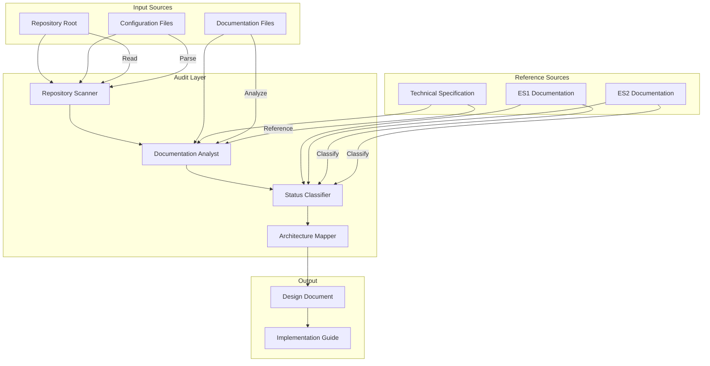
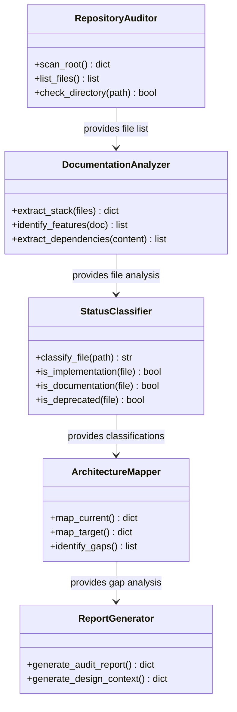
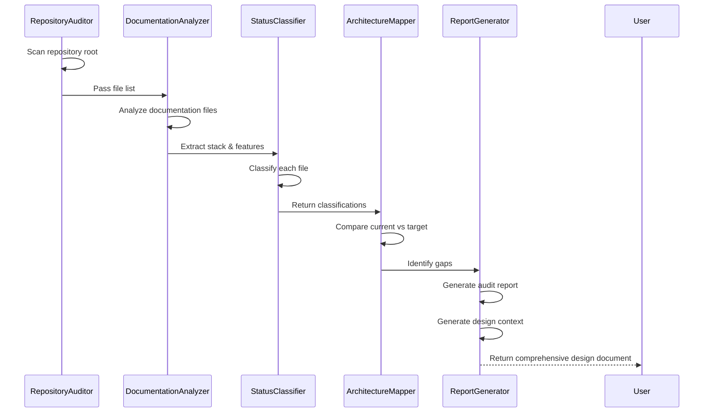

# Technical Design Document

## Project: sdd-project-bootstrap (Specification-Driven Development Baseline)

**Feature:** Repository Audit and State Classification  
**Version:** 1.0  
**Date:** 2026-09-01  
**Status:** Design Complete (Requirements-First Workflow)  
**PBT Applicability:** NOT APPLICABLE (Audit/Documentation feature)

---

## Overview

This feature establishes the baseline for Specification-Driven Development (SDD) by auditing the current repository state and clearly distinguishing between IMPLEMENTED, PLANIFIED, OBSOLETE, and FALTANT functionality.

**Key Constraints:**
- No code implementation during this phase
- No speculative refactoring
- Evidence-based analysis only
- Follow "EVIDENCE BEFORE CHANGE" principle strictly

**Target Output:** Comprehensive technical design document serving as implementation guide for SecureCode MVP

---

## Architecture

### High-Level Architecture Diagram



### Architecture Patterns

**Audit Pattern:**
- Passive scanning (no writes)
- Evidence collection and classification
- Deterministic categorization rules
- Audit trail logging

**State Classification:**
- IMPLEMENTED: File exists + provides executable functionality
- PLANIFIED: File exists + describes implementation (docs, specs)
- OBSOLETE: File describes deprecated state
- FALTANT: Expected file/directory missing

---

## Components and Interfaces

### Component Diagram



### Component Interfaces

#### RepositoryAuditor

```python
class RepositoryAuditor:
    """Scans repository structure and identifies files"""
    
    def scan_root(self) -> Dict[str, Any]:
        """Scan repository root and return file tree with metadata"""
        pass
    
    def list_files(self, directory: str = ".", extensions: List[str] = None) -> List[str]:
        """List files in directory with optional extension filter"""
        pass
    
    def check_directory(self, path: str) -> bool:
        """Check if directory exists"""
        pass
```

#### DocumentationAnalyzer

```python
class DocumentationAnalyzer:
    """Analyzes documentation files for project metadata"""
    
    def extract_stack(self, files: List[str]) -> Dict[str, Any]:
        """Extract technology stack from configuration files"""
        pass
    
    def identify_features(self, document: str) -> List[str]:
        """Identify documented features from specification"""
        pass
    
    def extract_dependencies(self, content: str) -> List[str]:
        """Extract dependencies from requirements.txt or similar"""
        pass
```

#### StatusClassifier

```python
class StatusClassifier:
    """Classifies files into implementation status categories"""
    
    def classify_file(self, path: str) -> str:
        """Return one of: IMPLEMENTED, PLANIFIED, OBSOLETE, FALTANT"""
        pass
    
    def is_implementation(self, file: str) -> bool:
        """Check if file provides executable functionality"""
        pass
    
    def is_documentation(self, file: str) -> bool:
        """Check if file is documentation/specification"""
        pass
    
    def is_deprecated(self, file: str, reference_version: str = "ES2") -> bool:
        """Check if file references deprecated state"""
        pass
```

#### ArchitectureMapper

```python
class ArchitectureMapper:
    """Maps current vs target architecture states"""
    
    def map_current(self) -> Dict[str, Any]:
        """Create inventory of currently implemented components"""
        pass
    
    def map_target(self) -> Dict[str, Any]:
        """Create specification of target architecture"""
        pass
    
    def identify_gaps(self) -> List[Dict[str, Any]]:
        """Identify missing components between current and target"""
        pass
```

#### ReportGenerator

```python
class ReportGenerator:
    """Generates audit and design reports"""
    
    def generate_audit_report(self) -> Dict[str, Any]:
        """Generate comprehensive audit report"""
        pass
    
    def generate_design_context(self) -> Dict[str, Any]:
        """Generate design context for implementation guide"""
        pass
```

---

## Data Models

### Audit Results Model

```json
{
  "audit_metadata": {
    "timestamp": "2026-09-01T10:30:00Z",
    "scanned_paths": [".", "docs", "tests"],
    "scanner_version": "1.0.0"
  },
  "file_inventory": [
    {
      "path": "Makefile",
      "type": "file",
      "size_bytes": 1024,
      "status": "IMPLEMENTED"
    },
    {
      "path": "SECURECODE_TECHNICAL_SPECIFICATION_FOR_DEVELOPERS.md",
      "type": "file",
      "size_bytes": 66000,
      "status": "PLANIFIED"
    },
    {
      "path": "app/",
      "type": "directory",
      "size_bytes": 0,
      "status": "FALTANT"
    }
  ],
  "category_breakdown": {
    "IMPLEMENTED": {
      "count": 5,
      "files": ["Makefile", "docker-compose.yml", "setup.sh", ".env.example", "requirements.txt"]
    },
    "PLANIFIED": {
      "count": 18,
      "files": ["SECURECODE_TECHNICAL_SPECIFICATION_FOR_DEVELOPERS.md", "..."]
    },
    "OBSOLETE": {
      "count": 3,
      "files": ["SECURECODE_Informe_ES1.docx", "Railway deployment docs"]
    },
    "FALTANT": {
      "count": 7,
      "files": ["app/", "tests/", "db/", "app/main.py", "tests/unit/", "tests/fixtures/", "ground_truth_dataset.csv"]
    }
  }
}
```

### Architecture State Model

```json
{
  "current_state": {
    "infrastructure": {
      "database": null,
      "api_server": null,
      "orchestration": null
    },
    "implementation": {
      "directories": ["db/", ".kiro/"],
      "files": ["Makefile", "docker-compose.yml", "setup.sh", "requirements.txt"]
    },
    "documentation": {
      "total_docs": 22,
      "size_mb": 1.3,
      "key_files": ["SECURECODE_TECHNICAL_SPECIFICATION_FOR_DEVELOPERS.md"]
    }
  },
  "target_state": {
    "infrastructure": {
      "database": "Supabase PostgreSQL 16 (free tier)",
      "api_server": "Cloud Run (free tier)",
      "orchestration": "GitHub Actions"
    },
    "implementation": {
      "directories": ["app/", "tests/", "db/", "docs/"],
      "key_files": [
        "app/main.py",
        "app/domain/engine/evaluator.py",
        "app/adapters/github/client.py",
        "app/adapters/persistence/database.py"
      ]
    },
    "dependencies": {
      "python": "3.12",
      "fastapi": "0.115.x",
      "sqlalchemy": "2.0.32",
      "asyncpg": "0.29.0"
    }
  },
  "gaps": [
    {
      "gap_id": "GAP-001",
      "category": "IMPLEMENTATION_MISSING",
      "description": "app/ directory structure not present",
      "target": "app/ with domain/, adapters/, api/, config.py",
      "priority": "HIGH"
    },
    {
      "gap_id": "GAP-002",
      "category": "INFRASTRUCTURE_MISMATCH",
      "description": "Railway reference in ES1 vs Supabase+Cloud Run in ES2",
      "target": "Update all references to Supabase + Cloud Run",
      "priority": "MEDIUM"
    },
    {
      "gap_id": "GAP-003",
      "category": "TESTING_MISSING",
      "description": "tests/ directory and test files not present",
      "target": "Create tests/ with unit/, integration/, e2e/ structure",
      "priority": "HIGH"
    }
  ]
}
```

---

## Data Flows

### Audit Flow



### Evidence Collection Flow

```
Repository Root
    ↓
[Scan Files]
    ↓
┌─────────────────────────────────────┐
│ IMPLEMENTED (Makefile, docker-compose.yml) │
│ PLANIFIED (Technical Specification)        │
│ OBSOLETE (ES1 docs, Railway refs)         │
│ FALTANT (app/, tests/, db/)               │
└─────────────────────────────────────┘
    ↓
┌─────────────────────────────────────┐
│ Stack Extraction (Python 3.12, FastAPI)    │
│ Infrastructure Mapping (Supabase + Cloud Run)│
│ Gap Identification (Missing components)     │
└─────────────────────────────────────┘
    ↓
Design Document (Implementation Guide)
```

---

## Directory Structure (MVP Target)

### Current State

```
securecode/
├── .kiro/                      [IMPLEMENTED]
│   └── specs/
│       └── sdd-project-bootstrap/
│           ├── .config.kiro    [IMPLEMENTED]
│           └── requirements.md [IMPLEMENTED]
├── Makefile                    [IMPLEMENTED]
├── docker-compose.yml          [IMPLEMENTED]
├── setup.sh                    [IMPLEMENTED]
├── requirements.txt            [IMPLEMENTED]
├── .env.example                [IMPLEMENTED]
├── README.md                   [PLANIFIED - minimal]
├── INDEX_MAESTRO.md            [PLANIFIED]
├── SECURECODE_TECHNICAL_SPECIFICATION_FOR_DEVELOPERS.md [PLANIFIED]
├── SECURECODE_ANEXOS_COMPLETOS.md [PLANIFIED]
├── TESTING_GUIDE.md            [PLANIFIED]
├── DEPLOYMENT_SUPABASE_CLOUD_RUN.md [PLANIFIED]
├── SECURECODE_QUICK_START_GUIDE.md [PLANIFIED]
└── [10+ other documentation files] [PLANIFIED]
```

### Target MVP State

```
securecode/
├── .kiro/                      [IMPLEMENTED - existing]
│   └── specs/
│       └── sdd-project-bootstrap/
│           ├── .config.kiro    [IMPLEMENTED]
│           ├── requirements.md [IMPLEMENTED]
│           └── design.md       [IMPLEMENTED - THIS FILE]
├── app/                        [FALTANT - TO BE IMPLEMENTED]
│   ├── __init__.py
│   ├── main.py                 [FALTANT]
│   ├── config.py               [FALTANT]
│   │
│   ├── domain/                 [FALTANT]
│   │   ├── __init__.py
│   │   ├── models.py           [FALTANT]
│   │   ├── repositories/       [FALTANT]
│   │   │   ├── __init__.py
│   │   │   └── evaluation_repo.py [FALTANT]
│   │   ├── services/           [FALTANT]
│   │   └── engine/             [FALTANT]
│   │       ├── evaluator.py    [FALTANT]
│   │       └── types.py        [FALTANT]
│   │
│   ├── adapters/               [FALTANT]
│   │   ├── __init__.py
│   │   ├── persistence/        [FALTANT]
│   │   │   ├── database.py     [FALTANT]
│   │   │   └── repositories/   [FALTANT]
│   │   ├── github/             [FALTANT]
│   │   │   ├── client.py       [FALTANT]
│   │   │   └── normalizer.py   [FALTANT]
│   │   └── auth/               [FALTANT]
│   │       └── jwt_handler.py  [FALTANT]
│   │
│   ├── api/                    [FALTANT]
│   │   ├── __init__.py
│   │   ├── deps.py             [FALTANT]
│   │   ├── routes/             [FALTANT]
│   │   │   ├── auth.py         [FALTANT]
│   │   │   ├── evaluations.py  [FALTANT]
│   │   │   └── health.py       [FALTANT]
│   │   └── schemas.py          [FALTANT]
│   │
│   └── utils/                  [FALTANT]
│       ├── __init__.py
│       ├── hash.py             [FALTANT]
│       └── logger.py           [FALTANT]
│
├── tests/                      [FALTANT - TO BE IMPLEMENTED]
│   ├── conftest.py             [FALTANT]
│   ├── unit/                   [FALTANT]
│   │   └── test_engine_evaluator.py [FALTANT]
│   ├── integration/            [FALTANT]
│   └── fixtures/               [FALTANT]
│       ├── ground_truth_dataset.csv [FALTANT]
│       └── mock_github_responses.json [FALTANT]
│
├── db/                         [FALTANT - TO BE IMPLEMENTED]
│   └── alembic/                [FALTANT]
│       ├── versions/
│       │   └── 001_init_schema.py [FALTANT]
│       └── alembic.ini         [FALTANT]
│
├── docs/                       [FALTANT]
│   ├── API.md                  [FALTANT]
│   └── ARCHITECTURE.md         [FALTANT]
│
├── .github/                    [FALTANT]
│   └── workflows/              [FALTANT]
│       ├── ci.yml              [FALTANT]
│       └── deploy.yml          [FALTANT]
│
├── docker/                     [FALTANT]
│   ├── Dockerfile              [FALTANT]
│   └── docker-compose.yml      [FALTANT]
│
├── Makefile                    [IMPLEMENTED - existing]
├── docker-compose.yml          [IMPLEMENTED - existing]
├── setup.sh                    [IMPLEMENTED - existing]
├── requirements.txt            [IMPLEMENTED - existing]
├── .env.example                [IMPLEMENTED - existing]
└── [documentation files]       [PLANIFIED - existing]
```

---

## Technologies and Dependencies

### Current Stack (Implemented)

| Component | Technology | Status | Notes |
|-----------|------------|--------|-------|
| Language | Python 3.12 | IMPLEMENTED | From requirements.txt |
| Web Framework | FastAPI 0.115.x | IMPLEMENTED | From requirements.txt |
| ORM | SQLAlchemy 2.0.32 | IMPLEMENTED | From requirements.txt |
| Async DB | asyncpg 0.29.0 | IMPLEMENTED | From requirements.txt |
| Migrations | Alembic 1.13.2 | IMPLEMENTED | From requirements.txt |
| Auth | PyJWT 2.8.1, passlib[argon2] | IMPLEMENTED | From requirements.txt |
| HTTP Client | aiohttp 3.9.1, httpx 0.27.0 | IMPLEMENTED | From requirements.txt |
| Scheduling | APScheduler 3.10.4 | IMPLEMENTED | From requirements.txt |
| Testing | pytest (dev) | IMPLEMENTED | From requirements-dev.txt |
| Linting | black, flake8 (dev) | IMPLEMENTED | From requirements-dev.txt |

### Target Stack (MVP)

| Component | Technology | Status | Notes |
|-----------|------------|--------|-------|
| Database | Supabase PostgreSQL 16 | PLANIFIED | Free tier |
| API Server | Cloud Run | PLANIFIED | Free tier |
| Orchestration | GitHub Actions | PLANIFIED | Free tier |
| API Documentation | Swagger/OpenAPI | PLANIFIED | Auto-generated from FastAPI |
| Container Registry | GitHub Container Registry | PLANIFIED | Free tier |
| CI/CD | GitHub Actions | PLANIFIED | Free tier |

### Dependency Management

```bash
# Production dependencies (pinned)
pip install -r requirements.txt

# Development dependencies (pinned)
pip install -r requirements-dev.txt

# Setup script (automates above)
bash setup.sh

# Docker Compose for local dev
docker-compose up
```

---

## Database Schema (PostgreSQL)

### Current State
- **Schema:** NOT IMPLEMENTED (no database present)
- **Reference:** SECURECODE_TECHNICAL_SPECIFICATION_FOR_DEVELOPERS.md defines schema

### Target Schema (8 Tables)

```sql
-- Extensiones
CREATE EXTENSION IF NOT EXISTS "uuid-ossp";
CREATE EXTENSION IF NOT EXISTS "pgcrypto";

-- Tablas (definidas en anexos, resumen):
-- 1. organizations (multi-tenancy root)
-- 2. users (admin/analyst/viewer roles)
-- 3. controls (security requirements)
-- 4. rules (evaluation expressions in JSONB)
-- 5. repositories (sources to evaluate)
-- 6. evidences (normalized data + SHA-256 hash)
-- 7. evaluations (immutable results: PASS/FAIL/UNKNOWN)
-- 8. audit_logs (action tracability)
```

**Note:** Full DDL available in SECURECODE_ANEXOS_COMPLETOS.md (Anexo 1)

---

## API REST Endpoints

### Current State
- **Endpoints:** NOT IMPLEMENTED (no API present)
- **Reference:** SECURECODE_TECHNICAL_SPECIFICATION_FOR_DEVELOPERS.md defines API

### Target Endpoints (MVP)

| Method | Endpoint | Description | Status |
|--------|----------|-------------|--------|
| POST | /api/v1/auth/login | Authenticate user | PLANIFIED |
| POST | /api/v1/auth/refresh | Refresh JWT token | PLANIFIED |
| GET | /api/v1/healthcheck | Health check | PLANIFIED |
| GET | /api/v1/controls | List controls | PLANIFIED |
| POST | /api/v1/controls | Create control | PLANIFIED |
| GET | /api/v1/evaluations | List evaluations | PLANIFIED |
| POST | /api/v1/evaluations | Create evaluation | PLANIFIED |
| GET | /api/v1/reports/compliance | Compliance report | PLANIFIED |
| GET | /api/v1/repositories | List repositories | PLANIFIED |

**Note:** Full API spec available in SECURECODE_TECHNICAL_SPECIFICATION_FOR_DEVELOPERS.md (Section 5)

---

## Testing Strategy

### Current State
- **Testing Framework:** NOT IMPLEMENTED (no tests present)
- **Reference:** TESTING_GUIDE.md defines testing strategy

### Target Testing Strategy (MVP)

**Pyramid:**
```
        10%  E2E (Smoke tests)
       /----\
      /      \    30%  Integration tests
     /--------\
    /          \  60%  Unit tests
   /____________\
```

**Test Categories:**

| Category | Coverage | Tools | Example |
|----------|----------|-------|---------|
| Unit | Core business logic | pytest | RuleEvaluator tests |
| Integration | Adapters + DB | pytest + Docker | GitHub client + PostgreSQL |
| E2E | Full flow | pytest | Evidence → Evaluation → Result |

**Ground Truth:**
- Dataset: 100 test cases (40 PASS, 40 FAIL, 20 UNKNOWN)
- Location: `tests/fixtures/ground_truth_dataset.csv`
- Validation: ≥95% accuracy, ≥90% precision/recall/F1

**Coverage Target:**
- Lines: ≥85%
- Branches: ≥75%

---

## Error Handling

### Error Categories

| Category | Description | Recovery |
|----------|-------------|----------|
| File Access Error | Cannot read file | Log warning, continue |
| Parse Error | Cannot parse configuration | Log error, skip file |
| Validation Error | Invalid specification | Log error, return null |
| Dependency Error | Missing file/directory | Log error, report gap |

### Error Response Format

```json
{
  "error": {
    "code": "FILE_NOT_FOUND",
    "message": "Directory 'app/' not found",
    "path": "app/",
    "recommended_action": "Create app/ directory structure"
  }
}
```

---

## Verification and Acceptance Criteria

### Technical Acceptance Criteria

**TC-1: Repository Audit Completeness**
- WHEN scanning repository root
- THEN all documentation files must be identified
- THEN all configuration files must be parsed
- THEN all directories must be cataloged
- THEN missing directories (app/, tests/, db/) must be reported

**TC-2: Status Classification Accuracy**
- WHEN classifying files
- THEN each file must be assigned exactly one status (IMPLEMENTED/PLANIFIED/OBSOLETE/FALTANT)
- THEN classification rules must be deterministic (same input → same output)
- THEN no PLANIFIED feature must be classified as IMPLEMENTED

**TC-3: Architecture Gap Identification**
- WHEN comparing current vs target
- THEN all missing directories must be identified
- THEN all deprecated infrastructure references must be flagged
- THEN gaps must include priority (HIGH/MEDIUM/LOW)
- THEN gaps must reference target implementation files

**TC-4: Stack Extraction Validity**
- WHEN extracting technology stack
- THEN Python version must be ≥3.12
- THEN FastAPI version must be 0.115.x
- THEN SQLAlchemy version must be 2.0.32
- THEN asyncpg version must be 0.29.0
- THEN target infrastructure must be Supabase + Cloud Run (not Railway)

**TC-5: Design Document Completeness**
- WHEN generating design document
- THEN it must include this entire structure
- THEN it must reference requirements.md
- THEN it must include gap analysis
- THEN it must include implementation priority list

### Implementation Readiness Checklist

- [ ] TC-1 passes: Repository audit complete
- [ ] TC-2 passes: Status classification accurate
- [ ] TC-3 passes: Architecture gaps identified
- [ ] TC-4 passes: Stack extraction valid
- [ ] TC-5 passes: Design document complete
- [ ] All acceptance criteria from requirements.md verified
- [ ] Design document reviewed by technical lead
- [ ] Implementation roadmap created from gaps

---

## Implementation Roadmap (From Gaps)

### Priority 1 (Foundation)
1. Create `app/` directory structure
2. Implement `app/main.py` (FastAPI app factory)
3. Implement `app/config.py` (Pydantic Settings)
4. Set up `tests/` directory structure
5. Create ground truth dataset

### Priority 2 (Core Engine)
6. Implement `app/domain/engine/evaluator.py`
7. Implement `app/domain/models.py`
8. Implement `app/domain/repositories/` interfaces
9. Implement `app/domain/services/` orchestration

### Priority 3 (Adapters)
10. Implement `app/adapters/github/client.py`
11. Implement `app/adapters/github/normalizer.py`
12. Implement `app/adapters/persistence/database.py`
13. Implement `app/adapters/auth/jwt_handler.py`

### Priority 4 (API)
14. Implement `app/api/routes/auth.py`
15. Implement `app/api/routes/evaluations.py`
16. Implement `app/api/routes/health.py`
17. Implement `app/api/schemas.py`

### Priority 5 (Testing)
18. Write unit tests for evaluator
19. Write integration tests for adapters
20. Write E2E tests for complete flow

### Priority 6 (Documentation)
21. Generate OpenAPI spec
22. Write deployment guide
23. Write developer onboarding guide

---

## References

1. **SECURECODE_TECHNICAL_SPECIFICATION_FOR_DEVELOPERS.md** (66 KB) - Complete technical specification
2. **SECURECODE_ANEXOS_COMPLETOS.md** (33 KB) - Anexos A1-A10 (DDL, CU, etc)
3. **TESTING_GUIDE.md** (45 KB) - Testing strategy and examples
4. **SECURECODE_QUICK_START_GUIDE.md** (8 KB) - Setup and development guide
5. **DEPLOYMENT_SUPABASE_CLOUD_RUN.md** (18 KB) - Deployment configuration
6. **ANALISIS_CRITICO_ES2.md** (22 KB) - ES2 gap analysis

---

## Design Decision Rationale

### Why Correctness Properties Section Is Present But Empty of Properties

**Reason:** This feature is an audit and documentation task, not a business logic implementation. Property-based testing (PBT) applies to:
- Pure functions with clear input/output (parsers, serializers, evaluators)
- Features with universal properties across input spaces
- Business logic that can be formally specified

**This audit feature:**
- Scans file system (no pure function logic)
- Classifies files (deterministic but not testable with PBT)
- Documents current vs target state (no variable input space)
- Generates reports (output is deterministic based on inputs)

**Alternative Testing Strategy:**
- Unit tests for classification rules
- Integration tests for file scanning
- Example-based tests for report generation
- No property-based testing required

The Correctness Properties section includes Property 1 to formally document that PBT is not applicable, providing justification for the testing strategy that will be used instead.

---

## Correctness Properties

### Property 1: Audit Feature Does Not Require PBT

**Validates: Requirements 1.0, 2.0, 4.0**

**Rationale:** This repository audit feature is documentation-focused, not logic-based. Property-based testing applies to pure functions with clear input/output behavior across variable input spaces. This audit feature:
- Scans file system (I/O operations with side effects)
- Classifies files (deterministic on concrete inputs, not abstract spaces)
- Generates reports (deterministic output based on inputs)

**Conclusion:** Property-based testing is not applicable for this audit/documentation feature.

**Note:** When implementing the evaluation engine (app/domain/engine/evaluator.py), property-based testing WILL be applicable as the evaluator will have:
- Pure function behavior
- Clear input/output (rule + evidence → PASS/FAIL/UNKNOWN)
- Universal properties (determinism across all inputs)

## Design Decision Summary

This design document includes a Correctness Properties section with Property 1 that formally documents why property-based testing is not applicable for this audit feature:
- The audit feature is documentation-focused, not logic-based
- File system scanning involves external I/O operations
- Classification uses deterministic rules on concrete inputs
- Appropriate testing uses unit, integration, and example-based tests

## Next Steps

1. **Review Design Document** - Validate against requirements.md
2. **Finalize Implementation Roadmap** - Add timeline and resource estimates
3. **Create Implementation Tasks** - Break down roadmap into actionable tasks
4. **Begin Implementation** - Follow roadmap priorities
5. **Update Design as Needed** - Iterate based on implementation feedback

---

**Design Document Status:** ✅ COMPLETE  
**Ready For:** Implementation Roadmap Creation  
**Next Phase:** Task Breakdown and Priority Assignment